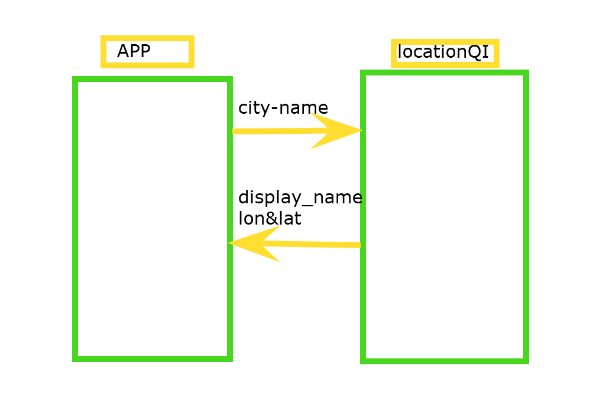
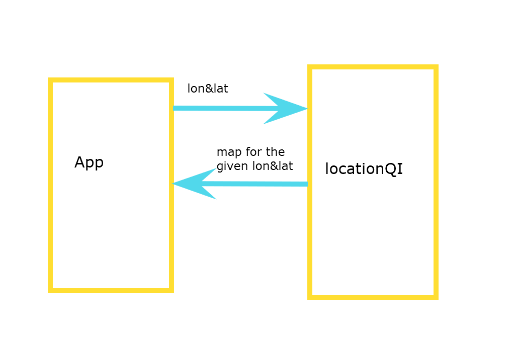

# Project Name

**Author**: Noortan Abu_Darwesh
**Version**: 1.0.0 

## Overview
The application retern the lon ,Lat, full city name and the map for the city name was entered

## Getting Started
click to this link [here]https://optimistic-davinci-a2738a.netlify.app/)

## Architecture
- ReactJs
- Bootstrap
- LocationQI API 
- weather API
- moviedb API

## Time Estimates

Name of feature: Set up your React repository & API keys.

Estimate of time needed to complete: 30 min

Start time: 2:00pm

Finish time: 2:20pm

Actual time needed to complete: 20 min

___
Name of feature:  Locations.

Estimate of time needed to complete: one hours

Start time: 2:30pm

Finish time: 4:20pm

Actual time needed to complete: 2 hours and 50 min
___
Name of feature: Map.

Estimate of time needed to complete: 30 min

Start time: 4:30pm

Finish time: 5:40pm

Actual time needed to complete: one hour and 10 min
___
Name of feature: Errors.

Estimate of time needed to complete: one hour

Start time: 6:00pm

Finish time: 6:40pm

Actual time needed to complete: 40 min
____________
Name of feature: movies.

Estimate of time needed to complete: 2 hour

Start time: 3:00pm

Finish time: 6:30pm

Actual time needed to complete: 3 hours and a half
______________________-
Name of feature: weather (live).

Estimate of time needed to complete: one hour

Start time: 2:00pm

Finish time: 2:40pm

Actual time needed to complete: 40 min